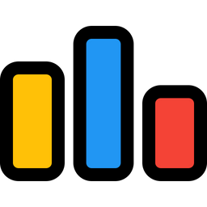
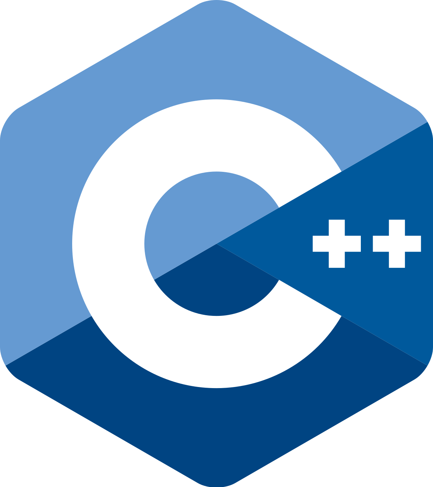
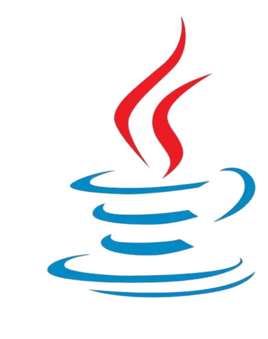
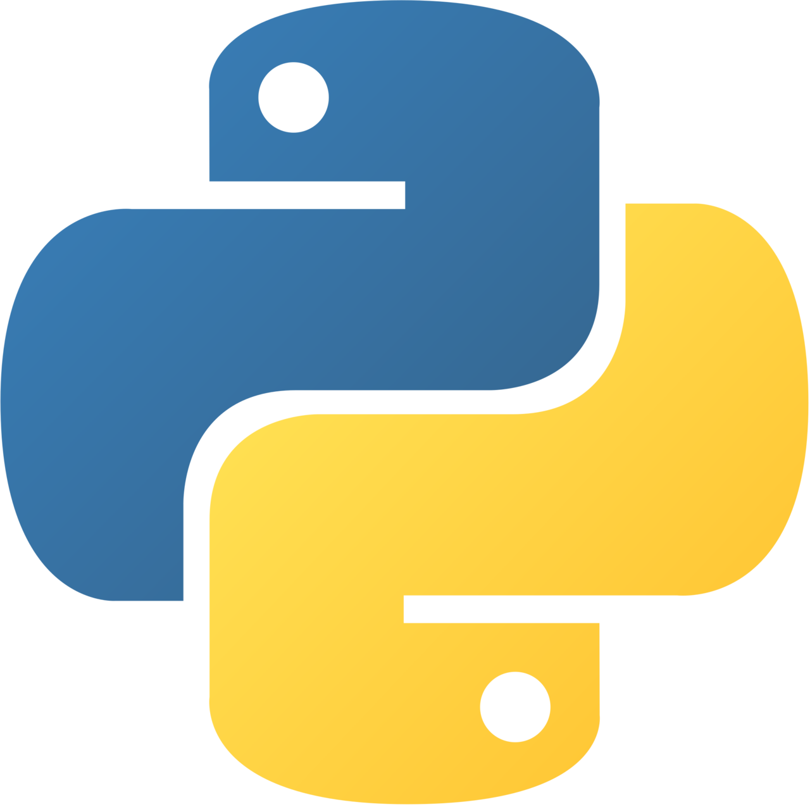
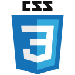
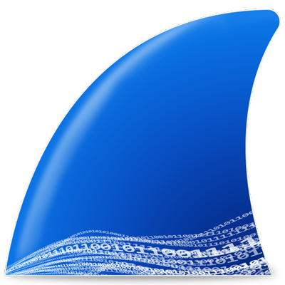
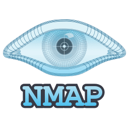

# Hi, I'm Ali Mohamed👋
Computer science student at Ain Shams University with a strong interest in cybersecurity, network security, penetration testing, and building practical projects. I enjoy learning new technologies, solving problems, and improving my skills through hands-on experience, CTFs, and teamwork.

### 🤝Connect with me:

  
  
  

  

  

### 🧠Languages:

  
  
  
  
  
  

### 🛠Tools:

  
  
  
  
  

<!--
**alimohamed7704/alimohamed7704** is a ✨ _special_ ✨ repository because its `README.md` (this file) appears on your GitHub profile.

Here are some ideas to get you started:

- 🔭 I’m currently working on ...
- 🌱 I’m currently learning ...
- 👯 I’m looking to collaborate on ...
- 🤔 I’m looking for help with ...
- 💬 Ask me about ...
- 📫 How to reach me: ...
- 😄 Pronouns: ...
- ⚡ Fun fact: ...
-->
